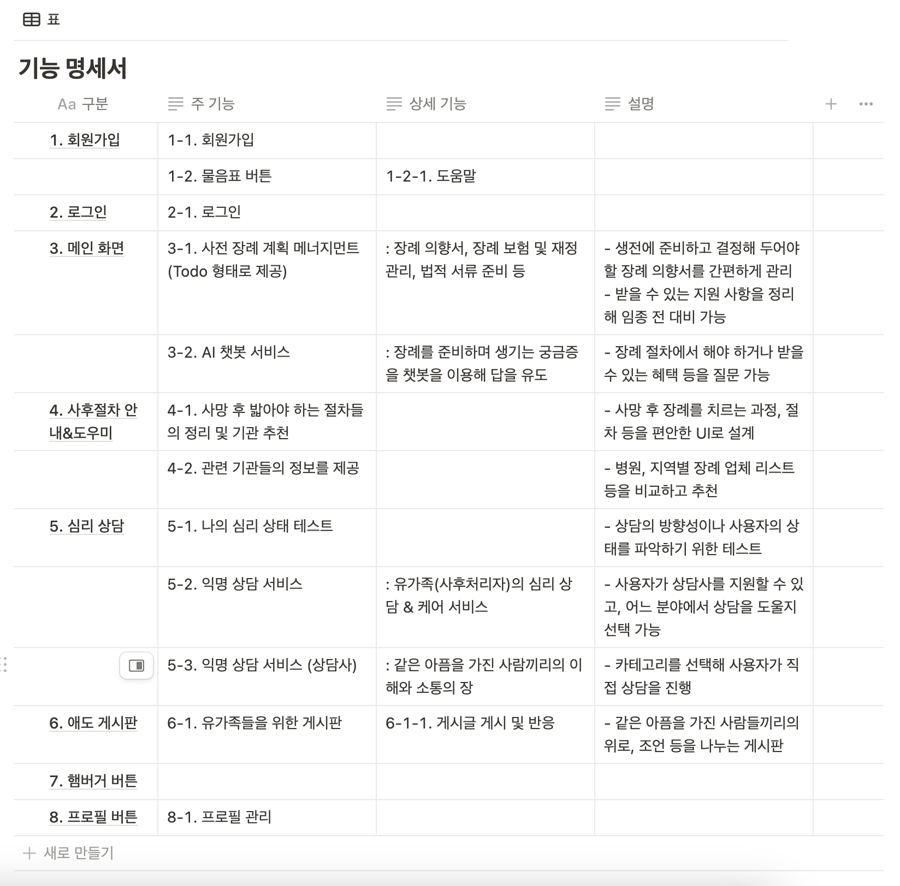

`크레센도`팀 해커톤 주제

## 팀명

크레센도

## 제품명

해바라기

## 참가 동기

애저 클라우드 서비스에 대한 깊은 이해와 활용 경험, 교외 사람들과의 협업 경험, 새로운 주제에서의 서비스 기획, 배포와 운영 경험 등 다양한 경험을 통해 새로운 지식을 습득하고 흡수해 언제 어떤 형태로든 실전에 투입 가능한 육각형 인재가 되고 싶었기 때문입니다.

## 주요 기능 및 특징, 기대 효과

1. **사전 장례 계획 서비스** : 고령화 인구의 사후준비 및 지원을 알기쉽게 정리해 사후 처리가 쉽도록 서포트
    > 노약자와 함께 직접 작성하여 대상의 의사를 최우선시해 반영한다.
    > 
    - 사전 장례시 작성해야 할 리스트
        - 유언장 작성
        - 장례식 및 매장 방법 결정
        - 장기 기증 여부 결정
        - 온라인 계정 관리
        - 재정 정리
        - 반려동물 돌봄 계획
        - 연락처 리스트 정리
        - 디지털 자산 관리(사진, 메모 등)
      **기대 효과** : 생전에 준비하고 결정해 두어야 할 장례 의향서를 간편하게 관리하고, 받을 수 있는 지원 사항을 정리해 임종 전 대비가 가능하게 한다.
2. **사후절차 안내&도우미 서비스** : 사망시 필요한 절차 체크리스트를 제공, 관련 기관의 연락처 안내
     **기대 효과** : 사망 후 장례를 치르는 과정, 절차, 병원, 지역별 장례 업체 리스트 등을 비교하고 추천해 보다 쉬운 사후 절차를 밟을 수 있게 한다.
3. **심리 상담 서비스** : 심리 상담사를 매칭해 유가족들의 심리 상담을 지원 (익명상담 지원)
    > 종교적 배경, 심리상태 등을 테스트를 통해 알아보고, 이를 고려해 심리 상담사를 매칭
      **기대 효과** : 테스트를 통해 상담의 방향성이나 사용자의 상태를 파악하고, : 유가족(사후처리자)의 심리 상담과 케어를 통해 빠른 일상생활의 복귀가 가능케 한다.
4. **애도 커뮤니티 제공** : 비슷한 경험을 갖고 있는 유가족들의 게시판 서비스를 지원
     **기대 효과** : 같은 아픔을 가진 사람끼리의 서로 소통하며 이해하고 위로, 조언 등을 나누어 유가족(사후처리자)의 멘탈을 케어한다.
5. **AI 챗봇 상담 시스템** : 장례를 준비하며 생기는 간단한 의문들에 답해주는 AI 도우미
     **기대 효과** : 장례를 준비하며 생기는 궁금증을 챗봇을 이용해 답을 유도하고, 장례 절차에서 해야 하거나 받을 수 있는 혜택 등을 질문할 수 있도록 한다.

## 제품 아키텍처 (이미지)

## 제품 소개 슬라이드

**(필수)** 제품 또는 서비스를 소개하는 슬라이드 덱을 리포지토리에 추가해 주세요. 슬라이드 덱은 [decks](./decks) 디렉토리에 저장한 후 이곳에 링크를 걸어주세요.

## 제품 소개 동영상

제품 또는 서비스를 소개하는 동영상을 YouTube와 같은 곳에 업로드하고 동영상 링크를 적어주세요.
